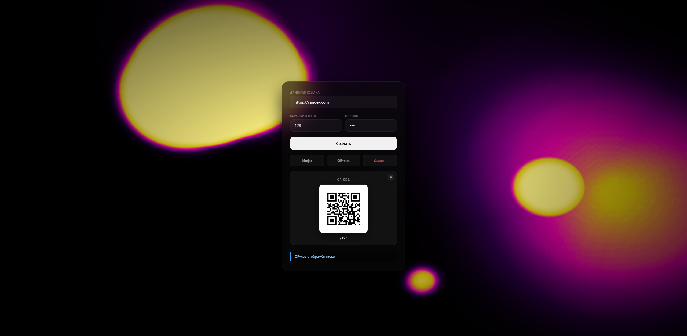
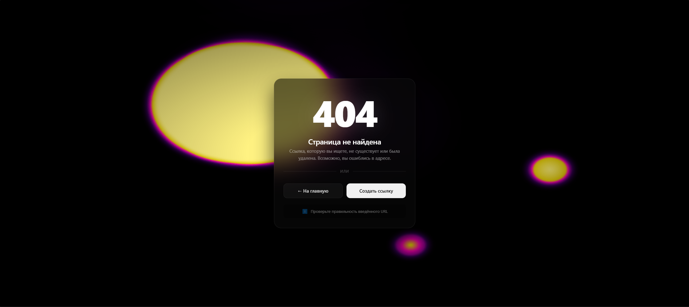

# QuickLink

Веб-сервис на Go для сокращения ссылок с поддержкой генерации QR-кодов, статистики и возможностью удаления по паролю.

## 🛠 Технологический стек

* **Язык разработки:** Go (Golang)
* **Хранилище данных:** Postrges (УКАЖИТЕ В ПЕРЕМЕННУЮ **connStr** ДАННЫЕ ДЛЯ ПОДКЛЮЧЕНИЯ К БД (**Пример:**connStr string = "host=localhost port=5432 user=postgres password=mysecretpassword"))

## ✨ Функциональность сервиса

1. **Сокращение ссылок** — создание коротких путей для длинных URL.
2. **Статистика переходов** — подсчет количества кликов по ссылкам.
3. **Генерация QR-кодов** — создание QR-кода для быстрого перехода.
4. **Удаление ссылок** — безопасное удаление по секретному паролю.
5. **Редирект** — мгновенное перенаправление пользователя на оригинальный URL.

## 📡 API Эндпоинты (Маршруты)

* `GET /` — Главная страница приложения (`index.html`).
* `POST /create` — Создание короткой ссылки. Принимает оригинальный URL и секретный пароль для удаления.
* `GET /{value}` — Редирект на оригинальный URL.
* `POST /info` — Просмотр информации о количестве переходов по ссылке.
* `GET /qr/{value}` — Получение изображения QR-кода для ссылки.
* `POST /delete` — Удаление ссылки (требуется передать верный секретный пароль).
* `GET /404` — 404 при ошибках (`404.html`).
